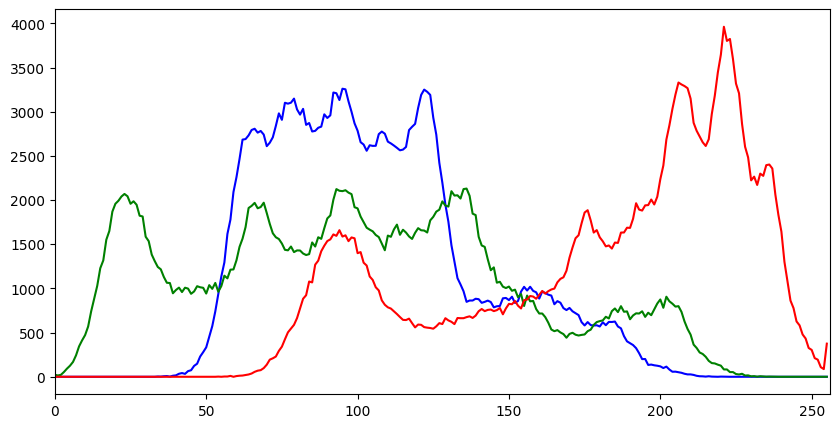

# Intro to Computer Vision

This is a section for Intro to Computer Vision for SIC week 6. Slide could be accessed in `mentoring-skilvul-sic/slides/Week 6 - Introduction to Computer Vision.pdf`.

## Materials

### OpenCV Basics

In the slide.

### RGB to Grayscale

### Scaling, re-sizing, Interpolations

### Image Masking

### Color Histogram

### Sharpening

### Blurring

### Thresholding Image

### Morphological Operations

In the slide.

### Edge Detections

### Line Detection

### Background Subtraction Methods

### Face and Eye Detection (Haar Cascade)

## How to use this notebook

First of all, you need to copy this folder `https://drive.google.com/drive/folders/1JWE8sq0gNTNTh3oK1sYr7tnIK_bixO_6?usp=drive_link` into your own drive, mount it in your Colab or on local, then use this notebook as walkthrough on each materials. Notebook code are in this directory.
